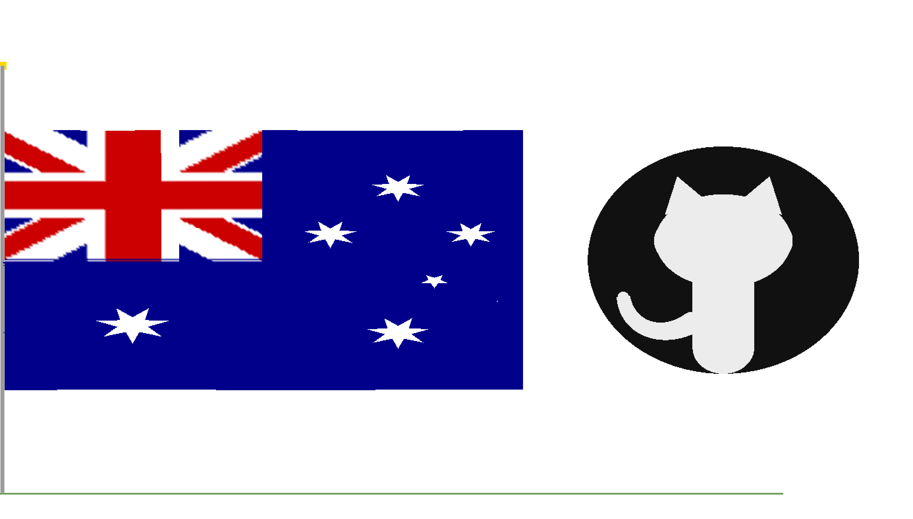

# 🇦🇺 Waving Australian National Flag – OpenGL/GLUT Simulation and github logo


OpenGL/GLUT-based simulation of the Australian National Flag with real-time wave animation, wind physics, and GitHub logo rendering.


A real-time 3D simulation of the Australian National Flag with a GitHub Octocat logo, built using OpenGL and GLUT in C++.

---

## 👥 Group Members

| # | Name | Student ID | File | Contributions |
|---|------|------------|------|---------------|
| 1 | Workye Gebre   | (02973/15) | `main.cpp`, `globals.h`, `globals.cpp` | Window init, camera, display loop, shared globals |
| 2 | Tamrat Beyene  | (01330/16) | `mesh.cpp`     | Flag mesh grid, wave displacement mathematics |
| 3 | Daniel Abraraw | (01841/16) | `colours.cpp`  | Australian flag colours, Union Jack canton |
| 4 | Nejat Ebrahim  | (02957/16) | `stars.cpp`    | Commonwealth Star, Southern Cross geometry |
| 5 | Mahlet Molla   | (01471/16) | `octocat.cpp`  | GitHub Octocat logo, 2D overlay, logo transforms |
| 6 | Rahmet Habtamu | (02963/16) | `scene.cpp`    | Flagpole, ground, HUD, keyboard controls, README |

---

## 📋 Project Overview

This project simulates a waving Australian National Flag using OpenGL primitives and real-time animation. It demonstrates:

- **Basic primitives**: `GL_POINTS`, `GL_LINES`, `GL_QUADS`, `GL_TRIANGLE_FAN`, `GL_TRIANGLE_STRIP`
- **Official Australian flag colours**: Navy Blue `RGB(0,0,139)`, Red `RGB(204,0,0)`, White `RGB(255,255,255)`
- **3D Transformations on flag**: Translation (X), Rotation (Y-axis), Scale
- **3D Transformations on logo**: Translation (X), Rotation (Z-axis), Scale
- **Multi-layer sine-wave cloth simulation** with adjustable wind
- **GitHub Octocat logo** rendered as a 2D overlay with interactive transforms

---

## 🗂️ Project Structure

```
aus-flag-opengl/
├── main.cpp        ← Member 1: window, camera, main loop
├── globals.h       ← Member 1: shared header (all externs)
├── globals.cpp     ← Member 1: all global variable definitions
├── mesh.cpp        ← Member 2: flag mesh + wave physics
├── colours.cpp     ← Member 3: flag colours + Union Jack
├── stars.cpp       ← Member 4: Southern Cross + Commonwealth Star
├── octocat.cpp     ← Member 5: GitHub logo + logo transforms
├── scene.cpp       ← Member 6: pole, ground, HUD, keyboard
└── README.md       ← Member 6: this file
```

---

## ⚙️ Setup & Dependencies

### macOS
```bash
xcode-select --install
```
GLUT is built into macOS — no extra install needed.

### Linux (Ubuntu/Debian)
```bash
sudo apt-get install freeglut3-dev
```

---

## 🔨 How to Build

### macOS
```bash
g++ main.cpp globals.cpp mesh.cpp colours.cpp stars.cpp octocat.cpp scene.cpp \
    -o flag -framework OpenGL -framework GLUT -Wno-deprecated
```

### Linux
```bash
g++ main.cpp globals.cpp mesh.cpp colours.cpp stars.cpp octocat.cpp scene.cpp \
    -o flag -lGL -lGLU -lglut -lm
```

---

## ▶️ How to Run

```bash
./flag
```

---

## 🎮 Controls

### 🏴 Flag Transforms
| Key | Action |
|-----|--------|
| `LEFT` / `RIGHT` arrow | Translate flag left / right |
| `A` / `D` | Rotate flag around Y axis |
| `W` / `S` | Scale flag up / down |

### 🐙 GitHub Logo Transforms
| Key | Action |
|-----|--------|
| `F` / `H` | Translate logo Horizontally left / right |
| `T` / `G` | Translate logo Vertically up/down
| `Q` / `E` | Rotate logo (Z axis spin) |
| `Z` / `X` | Scale logo up / down |

### 💨 Wind Controls
| Key | Action |
|-----|--------|
| `I` / `K` | Increase / decrease wind strength |
| `J` / `L` | Change wind direction |

### General
| Key | Action |
|-----|--------|
| `R` | Reset ALL transforms (flag + logo + wind) |
| `ESC` | Quit |

---

## 🎨 Features

### Australian Flag
- Accurate **Union Jack canton** with:
  - St George's Cross (red, horizontal + vertical)
  - St Andrew's diagonal (white)
  - St Patrick's diagonal (red, counterchange offset)
- **Commonwealth Star** — 7-pointed, below canton
- **Southern Cross** — 4 × 7-pointed + 1 × 5-pointed (Epsilon Crucis)

### Wave Animation
- Multi-layer sine wave: primary + harmonic + noise component
- Damping at the hoist — pole side stays fixed, free edge moves most
- Wind direction and strength adjustable at runtime

### GitHub Octocat Logo
- Full Octocat silhouette: dark circle, head, ears, ear tips, body, Bezier-curve tail
- Rendered as a **2D orthographic overlay** on the right side
- **Interactive transforms**: translate, rotate (Z-axis), scale
- All transforms pivot around the logo centre

---

## 🔧 How the Code is Split

Each member owns exactly one file (or files for Member 1). The files are compiled together:

```
main.cpp  ──calls──►  drawFlagMesh()   [mesh.cpp]
          ──calls──►  drawStars()      [stars.cpp]
          ──calls──►  drawGitHubLogo() [octocat.cpp]
          ──calls──►  drawPole()       [scene.cpp]
          ──calls──►  drawGround()     [scene.cpp]
          ──calls──►  drawHUD()        [scene.cpp]

mesh.cpp  ──calls──►  bgColour()       [colours.cpp]

All files ──include──► globals.h / globals.cpp  [shared state]
```

---


---

## 📝 Notes

- All source files must be compiled together in one command (see Build section)
- `globals.cpp` defines all shared variables — it must always be included in the compile command
- Each group member committed their own file with individual commit messages to demonstrate contribution
